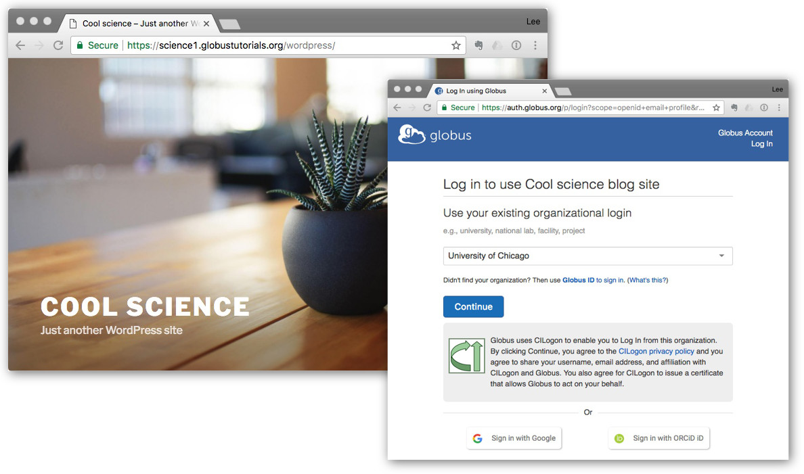
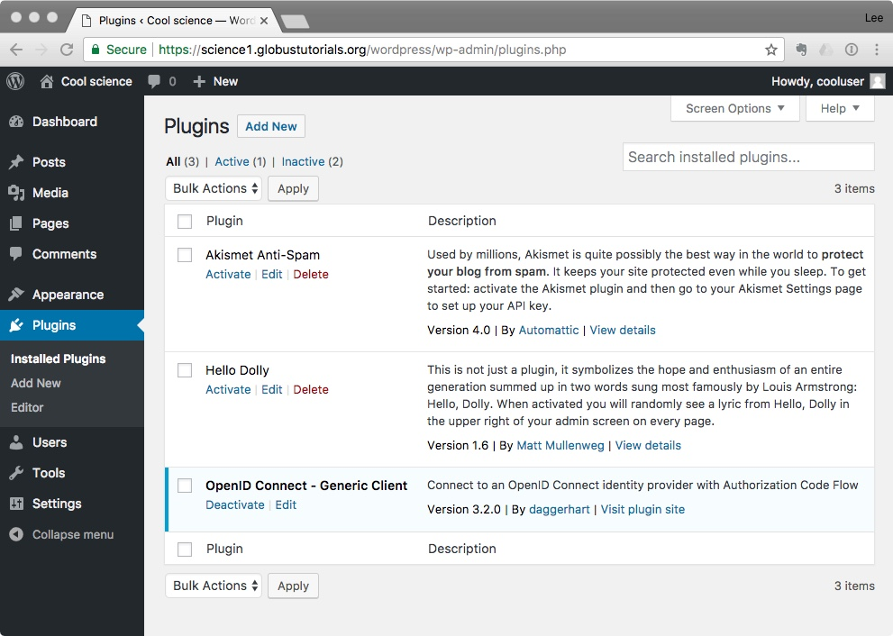
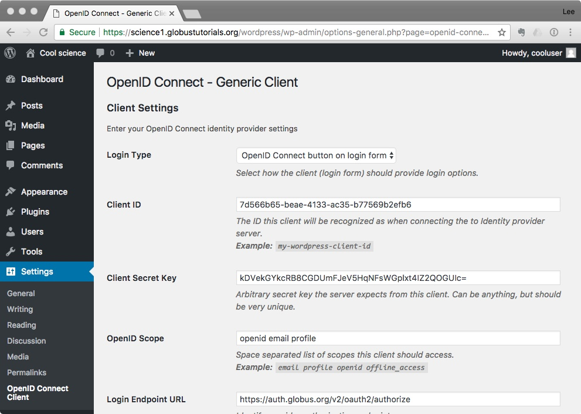
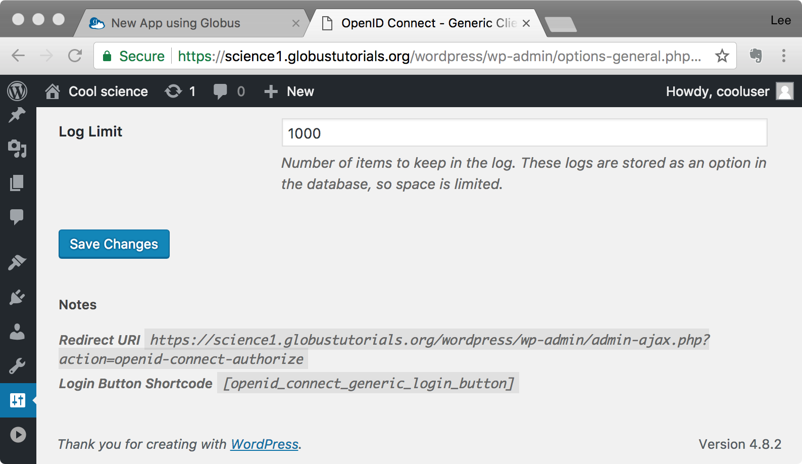
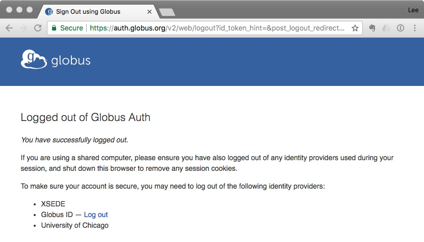
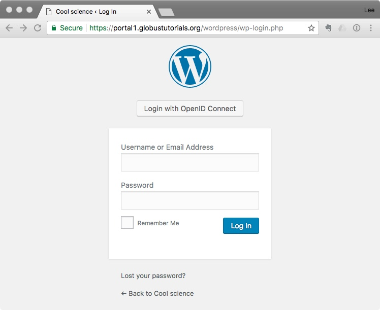
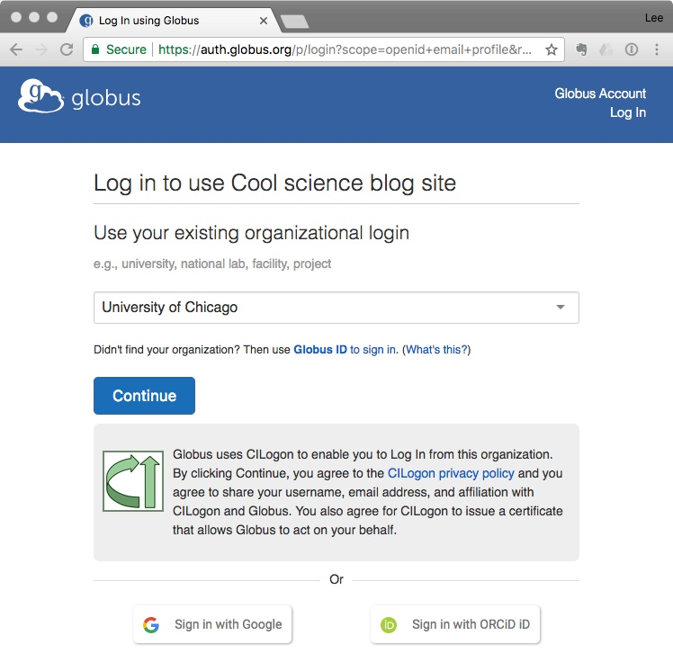

Galaxy Globus Auth OIDC Configuration
=====================================

You can add Globus Auth to a WordPress site without writing any code. You’ll do most of 
the work using a Web browser. After you have a WordPress site set up, it will take about
20 minutes to add Globus Auth logins to it.

This method works because Globus Auth is a standard `OpenID Connect`_ (OIDC) service, and
there's already good support in the WordPress community for OIDC.

.. _`OpenID Connect`: http://openid.net/connect/

What you'll need
----------------

- An existing WordPress installation (`Download WordPress`_ or `Setup a WordPress host`_) 
- An `OIDC plugin for WordPress`_

Your WordPress site must have SSL/TLS security enabled to use Globus Auth. In your Web
browser, the address of your site should begin with ``https://``.  You'll have this 
automatically if you're using a hosted WordPress site. If you're running 
your own server, you'll need to obtain and install a secure server certificate. We 
recommend `Let's Encrypt`_ because it's free and because it's easy to use
with most popular Web servers.

.. _`Download WordPress`: https://wordpress.org/download
.. _`Setup a WordPress host`: https://wordpress.com/pricing/
.. _`OIDC plugin for WordPress`: https://wordpress.org/plugins/daggerhart-openid-connect-generic/
.. _`Let's Encrypt`: https://letsencrypt.org/

Make it happen
--------------

In a nutshell, the method for enabling Globus Auth logins in a WordPress site is as follows.

1. Obtain and install an OpenID Connect (OIDC) plugin for your WordPress site.
#. Activate the plugin and configure it.
#. Register your WordPress site with Globus and obtain your site's ``client_id`` and ``client_secret``.
#. Configure the plugin with your ``client_id`` and ``client_secret``.

Get an OIDC plugin
------------------

WordPress has a huge library of plugins provided by community members. The library is accessed from
your WordPress dashboard by clicking ``Plugins`` in the left sidebar, then ``Add New`` at the top
of the Plugins page. If you search for "openid connect," you'll find a large number of social login plugins 
that let people login using Google, Facebook, LinkedIn, etc. There's also a plugin called "OpenID Connect
Generic Client." The author is "daggerhart" (Jonathan Daggerhart). This is a great plugin to use with
Globus Auth.

Install the OpenID Connect Generic Client plugin by clicking the ``Install Now`` button.

Activate and configure your plugin
----------------------------------

Now that you have a WordPress site with an OIDC plugin installed, the next step is to configure 
the plugin to use Globus Auth.  When logged in to your WordPress site, you should see the Dashboard 
shown in Figure 1. Click ``Plugins`` on the left-side navigation panel.

   **Figure 1.** Show your WordPress plugins.

Click ``Activate`` under the ``OpenID Connect - Generic Client`` plugin title.

Now that your OpenID Connect plugin is activated, you can configure it. Click ``Settings`` 
in the left-side navigation panel and select “OpenID Connect Client.” You’ll see the 
settings panel shown in Figure 2.

   **Figure 2.** WordPress OpenID Connect plugin settings panel.

To continue, you’ll need a Client ID, a Client Secret Key, and a few other things 
that you don’t have yet. All of these items come from Globus Auth. So now it’s time 
to register your Web application with Globus Auth.

Register your application with Globus Auth
------------------------------------------

Keep the WordPress window open and open another Web browser window. In this one, follow the 
`application registration instructions`_ in the Globus Auth Developer's Guide.
As you follow these instructions, note that the Redirect address you'll need during 
registration is provided by your WordPress OIDC plugin.  Go back to the WordPress 
window and scroll to the very bottom of the OpenID Connect configuration page. 
The Redirect URI is shown at the very bottom of the page, as shown in Figure 3. 

.. _`application registration instructions`: https://docs.globus.org/api/auth/developer-guide/#register-app

   **Figure 3.** Find the Redirect URI in your OpenID Connect plugin's configuration page.

When you've successfully registered your WordPress site with Globus, leave the registration
data page open in your browser. You'll need it below.

Finish configuring the plugin
-----------------------------

Return to your WordPress window, paste in the ``Client ID``, then complete the rest of the settings 
panel using the information in the following table.

==============================  ================================
OIDC Settings Field             Fill with...
==============================  ================================
Login Type                      *Default -* ``OpenID Connect button on login form``
Client ID                       *Copy and paste from Globus app registration*
Client Secret Key               *Scroll to the bottom of the Globus app registration view and generate a 
                                new client secret key. Name it whatever you like, and copy and paste 
                                the secret key from the Globus registration window into the WordPress 
                                window. If you lose the key, simply generate a new one.*
OpenID Scope                    ``openid email profile``        *separate each word with spaces*
Login Endpoint URL              ``https://auth.globus.org/v2/oauth2/authorize``
Userinfo Endpoint URL           ``https://auth.globus.org/v2/oauth2/userinfo``
Token Validation Endpoint URL   ``https://auth.globus.org/v2/oauth2/token``
End Session  Endpoint URL       ``https://auth.globus.org/v2/web/logout``
Link Existing Users             *Check this box!*
*Everything else...*            *...leave default values*
==============================  ================================

When you’ve finished filling out the settings panel, click ``Save Changes`` at the 
bottom of the page.  *Your work is done!*

Try it out
----------

Once you’ve configured your OpenID Connect plugin, your WordPress site is ready to 
use with Globus Auth. Sign out of the site by hovering your pointer over your 
userid in the upper-right corner of the WordPress window and select ``Log Out.`` 
You should see the Globus “Logged out” page, shown in Figure 4.

   **Figure 4.** Your new logout page.

For good measure, go ahead and click on the ``Log out`` link for Globus ID as well.

Now, when you return to your WordPress site and click ``Log in``, you’ll see the OpenID 
Connect button above the login box, shown in Figure 5. (You can change this to 
something better, like “Login with Globus,” later.)

   **Figure 5.** Your login page with OpenID Connect button.

Click ``Login with OpenID Connect,`` and you’ll see the Globus login page, shown in 
Figure 6.

   **Figure 6.** Your new login page.

Notice that the login page in Figure 6 shows the application name that you entered 
when you registered the Web app with Globus Auth.  You can change this name at any 
time by returning to developers.globus.org and clicking ``Edit`` when viewing the 
app registration.

When you complete the Globus login, WordPress will create a user account for your 
Globus identity and assign the basic subscriber role to the account. The same will
happen for anyone else who logs in. When you login as an administrator, you can see 
these accounts and assign different roles where appropriate.

